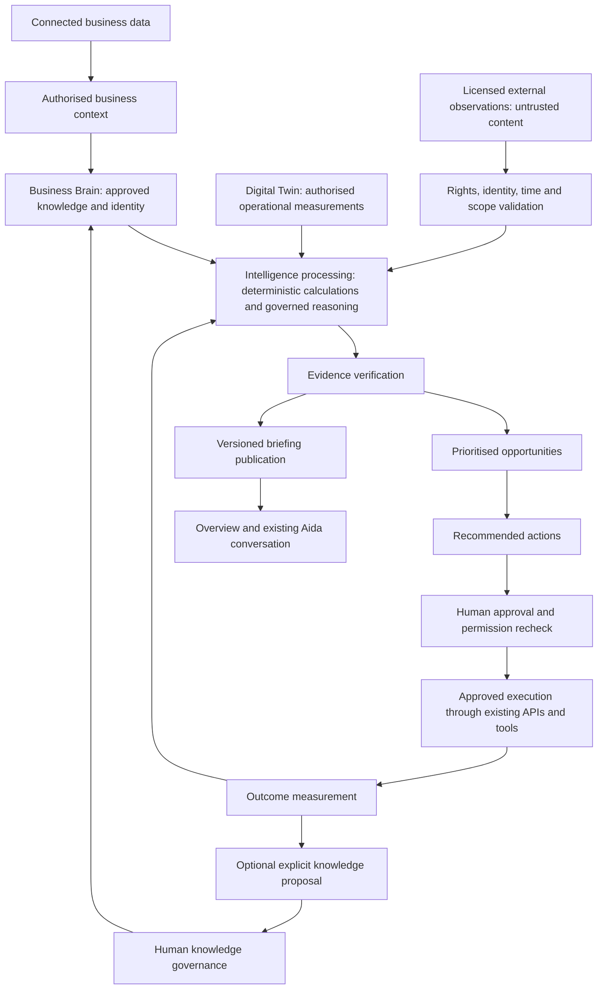
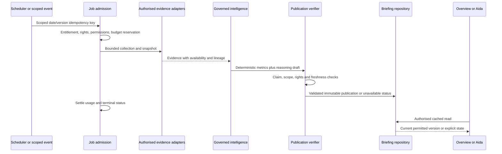
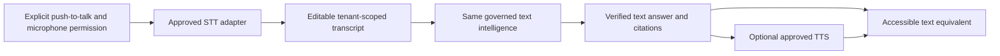

# DigitalGate Aida Intelligence architecture

Design only — 2026-10-09. Baseline `5a08e2f76b786d5a45c03565b3816bcf9574971c`. This document proposes the complete target; it does not claim deployment or implement any feature. The [capability matrix](AIDA-INTELLIGENCE-CAPABILITY-MATRIX.md) is the authority for inspected implementation status. The [roadmap](AIDA-INTELLIGENCE-IMPLEMENTATION-ROADMAP.md) defines dependencies and activation gates.

## Purpose and invariants

Aida understands an authorised business, explains measured performance, monitors permitted relevant developments, identifies opportunities, proposes actions and measures their outcomes. Every material statement must have inspectable evidence or be visibly labelled as an assumption, hypothesis or uncertainty. Unknown metrics remain unknown. Models cannot grant access, approve their own output, update trusted memory or execute business actions.

Reuse Platform Core, canonical organisation profile/goals, Business Brain knowledge, Digital Twin, connectors, CRM, tasks, opportunity engine, communications, shared AI transport/gateway, Activity/AuditLog and existing conversation interfaces. New components below are bounded responsibilities within that infrastructure, not new independent AI engines or parallel stores. Additive persistence contracts require separate schema approval; no schema is added by this task.

## Unified flow and trust boundaries

External observations enter an evidence envelope, not the permanent Brain. Brain provides durable business meaning; Twin provides time-bound observations. “Intelligence processing” is orchestration of existing calculations/rules and approved gateway tasks. “Evidence verification” is a deterministic publication boundary plus targeted human review; a second model agreeing is not proof.

| Component | Responsibility | Boundary and reuse |
| --- | --- | --- |
| Scope resolver | Authenticate actor; derive active organisation, business, membership and permissions | Existing session/access infrastructure. Current profile is organisation-scoped; map business to organisation explicitly until an authoritative multi-business resolver is approved. Never accept browser scope as authority. |
| Context assembler | Select minimally necessary profile, approved knowledge, permitted entity records and KPI definitions | Extend existing business context/approved context. Enforce source read permission and effective validity before retrieval, not after model generation. |
| Evidence adapters | Retrieve authorised internal observations and approved external observations with lineage/rights | Extend connector framework and Twin metric producers. Do not copy CRM into a second operational database. |
| Metric/calculation layer | Produce versioned deterministic observations, comparable windows, completeness and quality flags | Extend existing Overview/Twin/intelligence functions. Freeze evidence snapshot per run; preserve units and period boundaries. |
| Intelligence orchestrator | Evaluate industry rules, candidates, risks, hypotheses and justified scenarios | Single Platform Core service using approved gateway tasks; no direct new provider integrations. |
| Publication verifier | Validate runtime schema, source authority, numeric derivations, claims, freshness and rights | Fail closed on material unsupported content. Quarantine failed drafts; safe incomplete publications only with clear section availability. |
| Opportunity lifecycle | Rank, dedupe, assign, reassess and link recommendations to canonical work | Extend existing opportunity engine; CRM deals only where a genuine sales deal exists, tasks only after explicit creation. |
| Action boundary | Review immutable payload, revalidate actor/source/target rights, execute idempotently | Existing tool registry/executor/API and communications workflows; model output has no write authority. |
| Outcome evaluator | Compare approved baseline and follow-up windows; record completion separately from impact | Extend existing AI Activity/AuditLog events and metrics. Outcomes do not automatically become approved knowledge. |
| Briefing publisher/read repository | Store validated immutable versions and authorised cached read models | Separate publication records from knowledge items; preferably evidence metadata under existing source registry with approved extensions, not a parallel knowledge store. |
| Conversation/channel adapters | Resolve question intent and relevant published evidence; text, later voice | Reuse shell support chat/Advisor. Public Aida stays isolated. A briefing ID/version is server-resolved, never trusted browser content. |

## Contracts: proposed, not existing schema

All contracts require strict runtime decoding, bounded strings/arrays, explicit versioning, unknown-field rejection, duplicate-ID rejection and tenant/foreign-reference checks. IDs and hashes establish linkage/integrity, not truth. Timestamps use UTC instants; business timezone defines reporting dates. Money uses integer minor units plus currency. Rates specify numerator, denominator and whether represented as fraction or percent.

| Contract | Required fields | Acceptance rules |
| --- | --- | --- |
| AuthorisedContext v1 | organisationId, server-derived businessId, actorId/servicePrincipal, permissionClass, permissionRevision, purpose, industry/geography, classification, approvedRecipients, policyVersion, assembledAt, authorised evidence IDs | Reader and service principal rights intersect; no system-wide access inherited by a tenant job. Recheck permission revision before publication/read/execution. |
| EvidenceObservation v1 | id/version, organisation/business scope or licensed shared-public scope, sourceRegistryId, provider and source URI/reference, entity identity/match basis, geography, collectedAt, observedFrom/To, providerPublishedAt if known, validUntil, classification, permittedReaders, rightsGrantId, verification state, freshness state, digest, lineage, payload reference | Immutable observation; shared-public source usage must be authorised for each tenant. Never infer a historical observation period from collection time. Payload retention must be licensed. |
| RightsGrant v1 | owner/provider, licence/contract reference, permitted purpose, collection method, storage/derivative/quotation/display/redistribution rights, attribution, geography, expiry, retention ceiling, revocation and reviewer | Unknown permissions deny collection/storage/publication as applicable. OAuth access alone does not confer republication rights. |
| MetricObservation v1 | scope, metricDefinitionId/version, value or null, unit/currency, window/timezone, numerator/denominator refs, dimensions/cohort, source IDs, measuredAt, completeThrough, coverage, availability reason, calculation version | Null reasons: not_connected, forbidden, stale, failed, incomplete, insufficient_sample, invalid_definition. Zero only if measured. Do not combine currencies or incompatible attribution models. |
| Finding v1 | findingId/version, scope, kind, observation/interpretation/hypothesis label, claim text, metric refs, claim-to-evidence mapping, contradiction refs, confidence dimensions, limitations, expiry | Material numeric claims bind to exact derived metric. AI cannot create source IDs or override verification. |
| Recommendation v1 | recommendationId/version, finding refs, proposed action/target, impact basis/range, effort/cost, risk, responsible user, required approvals, priority explanation, outcomePlan, expiresAt, reviewAt | Estimated impacts are labelled scenario assumptions, not observed revenue or guaranteed uplift. Unknown impact remains qualitative. |
| ApprovalReceipt v1 | scope, actor, payload digest/version, action/target, approvedAt, expiry, permission/policy versions, idempotencyKey, status | Receipt cannot be reused for changed recipients, content, target, price or budget. Recheck at execution; revoke on changed authority. |
| OutcomePlan/Observation v1 | recommendation and action correlation, baseline window/value/source refs, target metric, comparison/control if available, follow-up window, confounders, observed outcome, attribution strength, review owner/date | Completed task is not demonstrated business benefit. No pre-intervention baseline means impact cannot be quantified retrospectively without suitable evidence. |
| BriefingPublication v1 | scope, permission class/revision, industry adapter version, business date/timezone, generation/evidence/policy versions, executive summary, sections, finding/recommendation refs, citations, generatedAt, validUntil, coverage, failure/availability states | Only validated evidence may be published. Publication time does not refresh source age. Partial sections remain explicit; sources and data unavailable are visible. |

Evidence verification states: unverified, identity_matched, corroborated, contradicted, rejected. Freshness states: current, delayed, stale, expired, unknown. Approval of a knowledge statement is distinct from verification of an external claim. Contradictions stay visible; “latest wins” cannot silently resolve a material conflict.

## Business understanding and approved knowledge

| Business dimension | Authoritative input and governance |
| --- | --- |
| Identity/structure | Organisation profile, legal/trading identity, memberships, approved locations and business relationships. A location is not an independently authorised business. |
| Industry/location | Approved primary/secondary industries, actual operating geography, timezone, sales versus management or service modality. Catalogue selection is a routing hint requiring confirmed profile context. |
| Products/services | Canonical catalogue plus approved service descriptions, eligibility and delivery capacity; current pricing from its owning module. |
| Customers/markets | Scoped CRM/customer segments and approved target audience. Keep personal details out of aggregate intelligence where unnecessary. |
| Objectives/KPIs | Existing goals plus approved versioned KPI definitions, target periods, owner and success criteria. |
| Marketing/sales | Connected channels, campaign attribution definitions, sales stages and stage history. Do not infer a business's funnel from another industry's template. |
| Financial/operations | Commerce/customer business records and service delivery evidence with accounting basis. Platform subscription revenue is not the customer's revenue. |
| Competitors | Owner-approved competitor identities/geographic sets plus licensed observed activity. Similar names and irrelevant regions are rejected. |
| Historical decisions | Approved action receipts and measured outcome events, with abandoned/rejected decisions and reasons preserved. Conversational speculation is not a decision record. |

Record epistemic type explicitly: verified fact, user-declared fact pending validation, preference, assumption, model interpretation, unverified external claim, or outdated fact. Preferences (tone, priorities) never establish market performance. Facts include source, effective period, owner, classification and review date. Assumptions include author and expiry; interpretations link evidence and remain outside trusted knowledge.

Knowledge updates reuse propose → review → approve/reject → supersede/archive. Only approved, permitted and temporally valid knowledge enters current context. Main approved retrieval currently filters status/organisation but not effective expiry: add validity enforcement before live use. Contradictory proposals require owner review. Changing a Brain item invalidates affected cached context/publications. Do not ingest whole conversations, recordings or recurring briefings into permanent knowledge. A user may explicitly nominate a bounded statement for proposal, with provenance and review; approval remains separate.

## Internal performance intelligence

These are required target calculations, not claims of existing measurements. Reuse available records only after validating semantics and completeness. The default comparison is completed business-local days: previous equal-length period and same weekdays; month-to-date compares equal elapsed completed days in the previous month, with year-on-year only when definitions and seasonality are comparable. Never compare partial current month with complete prior month without labelling it.

| Intelligence | Required data and deterministic calculation | Minimum evidence/freshness and missing behaviour |
| --- | --- | --- |
| Lead generation | Unique lead IDs, created timestamps, source/campaign, consent and duplicate/spam flags; counts by channel/cohort and count change | Daily, proposed internal TTL 24h; full relevant period and dedupe rules. Missing channels mean covered-channel count only. |
| Lead quality | Approved qualification rubric, assessed leads, criteria, assessor/time; qualified/assessed and unassessed count | Daily; disclose rubric version and assessment coverage. No universal AI quality score or inferred missing qualification. |
| Conversion | Stage-entry history and outcome dates; converted/eligible cohort with maturation period | Daily; same cohort and fully observed lag. Denominator zero → unavailable; unresolved cohorts labelled immature. |
| Pipeline | Deal/stage/value/currency, status and transitions; open value, ageing and stage flow | Daily; canonical deal values. Weighted forecast only with approved/calibrated stage probabilities, never property asking-price totals as business income. |
| CAC | Approved acquisition costs including included labour/fees and attributed new paying customers; acquisition costs/new customers | Monthly finance close, proposed TTL 7d after close. Attribution coverage required; ad spend/lead is CPL, not CAC. |
| Marketing ROI | Attributed contribution profit, marketing cost, refunds and lag; (incremental contribution − marketing cost)/marketing cost | Monthly; causal incrementality needs experiment/credible control. Without it publish attributed return with limitations, not incremental ROI. |
| Website performance | Complete analytics aggregates, sessions/engagement/key events plus technical PageSpeed measurements; engagement and event rates | Daily collection, provider complete-through lag. Limited channels/top queries cannot be presented as site totals; users across dimensions need deduplication. |
| Search visibility | Authorised Search Console aggregate clicks/impressions, query/page sets and technical SEO; CTR=clicks/impressions, impression-weighted position | Daily collection, latest complete provider day. Show property/search type/device coverage; SEO score and AI visibility score are not measured demand/share. |
| Advertising | Spend/impressions/clicks/conversions/value per campaign, currency and attribution window; CTR, CPC, CPA, ROAS=value/spend | Daily, 24h collection target plus provider lag. Partial conversion coverage blocks complete totals; cross-platform conversions require dedupe. ROAS is not profit ROI. |
| Retention | Customer/contract cohorts, renewals/cancellations, repeat transactions and observation horizon; retained eligible customers/starting eligible cohort | Weekly, proposed TTL 7d. Do not equate repeat enquiries or active contacts with retained customers. |
| Revenue/recurring revenue | Settled/recognised ledger basis, refunds, tax treatment, currency, subscription schedule; approved revenue sums and normalised recurring amounts | Daily provisional, monthly reconciled; exclude one-off fees from MRR. Active subscription count alone cannot produce MRR. |
| Operational efficiency | Job cycle times, staffing hours/cost, completions/rework/SLA and capacity; median cycle time, on-time rate, utilisation with defined capacity | Daily/weekly; incomplete time sheets block productivity/margin claims. Services vary; no universal utilisation target. |
| Customer experience | Reviews, survey invitations/responses, complaints, resolution times and linked period; response/complaint rates and approved satisfaction measures | Weekly; sample size and selection bias explicit. Do not invent NPS from star reviews or sentiment. |

Minimum comparative evidence: two comparable complete windows with unchanged metric definitions and explicit coverage. Counts can be described at any known sample size; proposed default suppresses directional rate recommendations below 30 eligible observations per window and always displays n. Industry owners may approve a different threshold with rationale; this is a proposed guard, not a statistically universal rule. Monetary claims require reconciled or visibly provisional basis. Material actions require valid evidence plus responsible human review even with large samples.

Confidence is a vector: source authority, identity match, freshness, completeness, sample adequacy, consistency and model/calculation reliability. Publish high/medium/low/insufficient with a reason and limitations; avoid invented precise confidence percentages. Weakest critical dimension caps confidence. Data completeness is not forecast accuracy. Forbidden data is unavailable without leaking its contents or existence.

## External market intelligence

Only approved source adapters collect evidence. Procurement/owner review must establish RightsGrant before collection; licence may permit links but prohibit storing full text, derived redistribution or audio narration. Store minimal metadata/excerpts where permitted; expire/purge according to rights. Do not scrape, republish or use search snippets as trusted facts by default. No external collection or licence verification occurs in this task.

| Domain | Candidate source class, subject to approval | Verification and observation period |
| --- | --- | --- |
| Industry/news | Licensed publisher feed, industry association or original announcement | Original date/event date, topic/entity/geography match; syndication dedupe. One report may establish that a claim was made, not that it is true. |
| Competitor activity | Approved competitor website/API or licensed listing/advertising feed | Confirm entity and location; capture effective campaign/listing period and changed fields. No inference of competitor revenue from visible activity. |
| Local markets | Licensed property/economic datasets and authorised local authority releases | Exact locality, property/service segment, reporting period and revision/vintage. Asking price differs from settled price. |
| Search trends | Approved trend dataset with methodology and usage rights | Query/region/normalisation/window; relative interest is not absolute search volume or demand. |
| Regulation | Official regulator/legislative publications via permitted collection | Jurisdiction, publication and effective dates, amended/superseded status. Flag review by responsible qualified person; do not treat summary as legal determination. |
| Emerging opportunities | Corroborated changes in supply/demand, public tenders or customer requests | Eligibility/deadline/entity match and commercial relevance; owner confirms capacity before action. |
| Industry indicators | Approved vertical data such as sales/settlements, lending changes or maintenance contracts | Units, revisions, coverage and economic meaning belong to adapter. Do not transplant an indicator into another industry. |

Proposed collection TTLs: news/competitor changes 24h, local datasets by their actual release cadence, search trends 7d, regulation every business day with immediate expiry on known amendment. These are review defaults; source-specific complete-through dates override them. Missing approval means disabled. A stale source may support an explicitly historical statement but not a current recommendation. Material disputed news requires independent corroboration or original-source verification; a copied article is not independent evidence. External observations never automatically become trusted Brain facts.

## Analysis and evidence verification

1. Deterministic trend layer computes deltas, rolling averages and cohort funnels with versioned formulas; excludes incomplete windows and explains definition changes.
2. Anomalies use approved rules initially; robust statistical baselines only with sufficient seasonal history. Require at least eight comparable periods for a proposed basic baseline, test false positives and multiple comparisons, and label outliers as detection rather than explanation.
3. Performance comparisons use business targets and matched periods; industry benchmarks need licensed, sufficiently sized and relevant cohorts. Never imply a live network benchmark from `networkCohortSize: 0` in existing Advisor assembly.
4. AI reasoning proposes root-cause hypotheses from verified observations, separating observed change, plausible mechanisms, counter-evidence and next diagnostic test. “Advertising fell and enquiries fell” is correlation; causation needs an intervention/control or stronger causal design.
5. Risks and opportunities reference exposure, horizon, responsible owner and evidence. Rule scores are priority signals, not probabilities of success.
6. Scenarios use explicit user-approved assumptions and deterministic calculations; show base/upside/downside and sensitivity. Assumptions stay labelled and are never substituted for actuals.
7. Forecasts require sufficient history, stable definitions and time-ordered holdout/backtesting against a naive baseline; report error and intervals. Reject unreliable or structurally changed series, sparse listing outcomes and invented pipeline probabilities. No forecast is preferable to a misleading one.
8. Prioritisation ranks legal/safety urgency for human review, deadline, evidence strength, plausible impact range, feasibility, effort, owner capacity and goals. Show reasons and dependencies; no fabricated dollar uplift.

Verifier rejects foreign/missing evidence IDs, unsafe links, expired licences, wrong entity/geography, unsupported values, contradictory unqualified claims and classifications inconsistent with sources. Recompute numeric claims and check citation support at claim level; language similarity and a valid hash do not verify semantics. New/high-risk claims require human review until demonstrated reliable. Reject unsupported causal language. Partial publication cannot contain a material finding dependent on failed evidence. Log content-free reason codes and provenance IDs, not raw confidential prompts.

## Opportunity and outcome model

Extend existing platform intelligence opportunities with scoped persistent lifecycle metadata and evidence links through an approved schema design. Keep canonical CRM `Opportunity` as the sales deal and `Task` as assigned work. An intelligence finding may link either without creating either. Existing post-collection org filtering must be replaced with authorised collection for tenant use; platform operator intelligence stays a separate authority path.

Each opportunity includes organisation/business, subject/entity, finding/version, supporting evidence IDs, observed versus estimated impact, confidence dimensions, urgency/deadline, recommended action, required approval/risk, responsible permitted user, status, outcome plan, review date and expiry. Proposed statuses: candidate → verified → open → accepted/deferred/dismissed → in_progress → completed → outcome_reviewed; expired/superseded may interrupt. Task completion changes work status but does not establish impact.

Deduplication key: scope + industry rule/version + subject + finding family + comparable observation window. Cluster repeated observations into an existing active finding, preserve evidence versions and distinguish material change. Enforce transactionally unique active keys; retries cannot duplicate tasks/deals/actions. User dismissal/defer reason and next review are respected until material new evidence or deadline. Expire on evidence/rights invalidation or rule TTL; reassess daily or on relevant event. An expired recommendation cannot execute without refreshed evidence and renewed approval.

Outcome plan is fixed before execution: baseline, target metric, expected lag, follow-up/control period, owner and confounders. At review record measured/no_effect/negative/inconclusive/unavailable and whether action completed. Link actual receipts and cost; separate operational completion, observed association and attributable impact. Briefings revisit previous recommendations without claiming every subsequent increase was caused by Aida.

## Extensible industry frameworks

An IndustryIntelligenceAdapter is a versioned configuration/rule contract in existing industry infrastructure: industry/subtype, approved metric definitions, entity types, stage mappings, permitted source adapters, geographic scope, comparison cohorts, sample/freshness rules, checkpoint rules, hypothesis/action templates, permissions and prohibited inferences. Shared mechanics remain central. Owners approve definitions; industry packs cannot relax platform security, budget or knowledge approval.

### Real estate — Roe Realty first proposed pilot

No customer data or integration activation is asserted. Resolve agency, locality, property ID, listing campaign start, property category, vendor authority and sales versus management first. Use canonical appraisal/leads, properties, inspections, enquiries/offers, campaign evidence and licensed comparables; audit stage history before calculations.

| Area | Measures and required evidence | Recommendation boundary |
| --- | --- | --- |
| Appraisal generation/conversion | Unique vendor/appraisal leads by channel, bookings/completions, signed listing agreements; eligible matured cohort conversion | Missing appraisal-to-listing linkage prevents conversion claims. Follow-up proposal may link existing lead/task. |
| Listing pipeline/vendor engagement | Stage/date history, mandates, vendor contact/feedback and agreed next review; pipeline ageing and contact timeliness | Pipeline asking-price value is not agency revenue; do not infer vendor satisfaction from email opens. |
| Buyer quality/inspections | Qualification with consent, unique property enquiries, attendance/no-shows, second inspections, objections, offers and conditions | Anonymous clicks are not qualified buyers; avoid identity duplication across visits. |
| Competition/local market | Licensed comparable active/sold listings matched by locality/type/features/date, days on market, settled-versus-asking price and provider coverage | Explain comparable mismatch, missing sold data and revision; no unsupported valuation. |
| Pricing/campaign | Price history, market exposure, enquiries, inspection/offer trajectory, buyer objections, campaign spend/channel coverage | Price hypothesis must distinguish low exposure, poor creative, access constraints, condition and financing from price rejection. |

Established vendor checkpoints are required workflow rules, with day counted from the approved campaign launch in business timezone. They produce evidence review tasks/recommendations, never autonomous price changes:

- **Days 1–7:** assess enquiry quality, competing listings and inspection attendance against campaign exposure and comparable segment; explain missing channels or inspection records.
- **Days 8–14:** review buyer objections, second inspections and offers; distinguish price feedback from property objections and financing conditions.
- **Days 14–21:** determine whether price is preventing conversion through converging buyer feedback, adequate exposure, inspection-to-offer behaviour and relevant comparables. With insufficient evidence, report an unresolved price hypothesis and request targeted evidence.
- **Before Day 28:** when evidence supports market rejection of the asking price, recommend decisive action: vendor review with documented rationale and options such as a reviewed price adjustment or campaign repositioning. Market rejection must be supported by adequate exposure, repeated qualified feedback and relevant comparable outcomes; calendar age alone is insufficient. Agent/vendor approval is mandatory, and existing mandate/legal obligations apply.

A qualified human defines “adequate exposure” and comparable rules for that segment before pilot activation. Aida must not manufacture thresholds or price targets. Lack of offers is an observation, not by itself proof of rejection. Review outcome after the agreed action window, considering campaign changes and broader market conditions.

### Mortgage broking — AIM Financial

Reuse scoped CRM, appointments, approved lending connectors and deal records. Define enquiry → qualified → application → lodged → approved → settled by lender/product with maturation lag. Metrics: appointment attendance, documentation completeness, application-to-approval/settlement conversion, cycle time, fall-through reasons, refinance review dates and consented follow-up. Revenue uses authorised settled commission/clawback basis, not loan principal. External rate/product/regulatory evidence needs effective date, lender eligibility and licence. Aida drafts review questions and follow-up; suitability, credit advice, lender commitments and customer financial disclosures require authorised broker review. No property-campaign checkpoint reuse.

### Cleaning and maintenance — My Venue Clean

Reuse ServiceJob, lead/contact, quote/invoice, task and scheduling records. Metrics: enquiry-to-site-visit/quote/approval conversion, quote turnaround, scheduled/completed work, on-time rate, repeat jobs/contracts, rework/complaints, labour hours, travel and contribution margin only with complete cost records. Compare site/service/frequency/contract cohorts. Recurring contract value needs schedule and cancellation semantics. Relevant external developments include local contract/tender opportunities and approved safety/supply developments. Proposed staffing/quote/service changes require manager approval; no inferred margin from revenue alone.

### General SME

Begin with approved goals, customer acquisition, sales stages, revenue basis, channel performance, retention and service quality where connected. Select only applicable metrics and industry mappings. A business without subscription contracts has no MRR metric; one without recorded labour capacity has no utilisation score. Support secondary industries without mixing incompatible cohorts or expanding permissions.

## Daily Business Briefing

Placement: **immediately above Growth Performance in Business Overview**, reusing the optional #1009 presentation foundation once separately reviewed. Proposed briefing explains (1) what changed, (2) why it matters, (3) relevant external developments, (4) next actions and (5) outcomes of previous recommendations. Include executive summary, performance highlights, risks, opportunities, industry developments, evidence/citations, confidence/freshness and recommended actions. Ask Aida opens the existing conversation with server-resolved publication ID/version. Future Listen narrates the same approved text and citations summary; playback never opens the microphone.

Schedule once per business-local day after source complete-through checks; exact delivery time is an owner decision. Authenticated cron enqueues bounded batches, not unbounded synchronous tenant generation. Relevant events (material metric change, campaign checkpoint, source correction, revoked rights, outcome due) invalidate or enqueue debounced refresh. Proposed default cooldown is 60 minutes, one scheduled run plus at most two material refreshes daily; budget/urgency policy may lower or separately approve increases. No paid generation on dashboard page load, cache miss, repeated refresh click or automatic chat draft opening.

Cache key includes organisation/business, permission class/revision, business date/timezone, industry/geography version, evidence snapshot, policy/task version and publication version. Source or authority changes invalidate it. Do not share mixed confidential briefings between tenants; public licensed observations may be reused only under each tenant's rights. TTL is the earliest applicable evidence, rights or publication expiry, proposed maximum 24h for current daily text.

Generation states: queued, collecting, analysing, verifying, published, partial, insufficient_evidence, budget_blocked, failed, expired. UI states: disabled/forbidden, loading cached read, empty setup, available, partial, stale, safe error. Empty state identifies permitted missing connections/definitions and next setup step. Internal-only or external-only partial briefing must say which sections are absent; never masquerade as a full combined briefing. #1009 currently requires 3–5 insights and rejects expiry; future partial/stale presentation requires an explicit versioned contract change, not fixture content or silent relaxation.

Lease/fence jobs, bound retries and recover abandoned work; reuse local inference lifecycle where applicable but add a separately approved orchestration record for collection/publication stages. Retrying publication need not repeat paid inference: reuse an authorised validated draft while fresh. Do not retry ambiguous paid calls automatically without provider-supported idempotency and budget treatment. Poison drafts go to review; failures retain a still-authorised previous publication only as visibly stale historical information, with current actionable recommendations disabled. Revocation triggers immediate denial/purge regardless of last-good cache.

Reserve a maximum job cost atomically before any paid collection/inference; include research API usage, retries and later speech. Proposed ceilings: one model synthesis per admitted run, bounded adapter requests, 8k input/2k output tokens only if approved task/model supports them, one active briefing job per business, bounded global concurrency. These are proposed caps, not currently registered gateway values (existing CRM tasks have smaller limits). Budget defaults to generation disabled until configured and approved. Measure actual usage and settle reservation once through existing ledger/outbox; unknown cost consumes reserved ceiling pending reconciliation.

## Conversational intelligence and guided assistance

Reuse ChatWidgetProvider/SupportChatPanel and Advisor context, converging business answers on a governed orchestration path. Resolve intent, retrieve permitted published findings or create an admitted bounded analysis, verify claims and return citations, window, freshness, uncertainty and useful next step. Keep support/platform documentation evidence distinct from customer intelligence and platform-only diagnostics. Unavailable context must not fall back to an invented answer or wider provider disclosure.

| User request | Evidence/answer path | Action boundary |
| --- | --- | --- |
| “Why are our enquiries down?” | Comparable unique lead/channel windows, tracking completeness, campaign/exposure changes and relevant market evidence; hypotheses with counter-evidence and diagnostic tests | No causal certainty from co-movement; propose a review/task. |
| “What opportunities should I focus on today?” | Current scoped opportunity records, deadlines, approved goals, owner capacity and previous dismissals | Explain ranking; acceptance/task creation separately confirmed. |
| “How is our business performing this month?” | Equal elapsed completed days, approved KPI definitions, finance basis and channel coverage | No extrapolated full-month result unless justified forecast is clearly separated. |
| “What changed in our local market?” | Licensed local observations with identity/geography, release vintage, citations and relevant time comparison | No generic national news presented as local evidence. |
| “What should we do about this listing?” | Authorised property/campaign ID, checkpoint evidence, buyer feedback and comparables | Agent/vendor reviews action; no automatic repricing or vendor message. |
| “Prepare a follow-up campaign.” | Consented segment, communication preferences, approved brand/services, finding refs and permitted templates | Produce draft/preview; review recipients, consent, content, channel, timing and budget before separately authorised send. Current AI tool registry does not implement this campaign action. |

Do not trust client-provided entity IDs without scoped lookup. Recheck access on each turn/history read/stream reconnect; cancel outstanding streams and clear client drafts on organisation change. Existing conversation ownership must be maintained; search/index extensions require tenant/business/actor predicates and source permissions. User question and external content are untrusted input, never system instructions.

Conversational onboarding uses actual existing setup progress, profile gaps and completion receipts. Aida can explain a next platform route or propose a bounded profile statement; writing profile/goals or knowledge requires appropriate review and permission. Contextual help retrieves versioned platform documentation and labels product availability rather than inventing installed features. Future narrated tutorials use approved scripts with text equivalents, publication versions and clear stopping controls.

## Future voice architecture — no implementation here

Microphone access only on deliberate user gesture; permission denial retains text functionality. Stop/page exit/tenant switch releases media tracks and cancels sessions. STT recipient, region and retention require approval; browser speech APIs cannot be assumed offline/private. No provider choice or live voice pricing is asserted. TTS consumes verified text, rechecks read permission and may not narrate material excluded by licence.

Recording consent is separate from transient transcription, OFF by default, with purpose/recipient/retention/deletion clearly stated. No raw audio persistence without valid opt-in. Tenant-scoped transcripts have separately disclosed retention; background speech is confidential. Delete recordings/transcripts and derived speech caches under approved policy, including provider deletion obligations and backup re-purge. Do not ingest transcripts into Brain. Session limits, audio minutes/tokens, daily budget reservations and abort controls are mandatory. Consequential voice requests produce visible review and durable approval; spoken ambiguity cannot count as confirmed execution.

## Security, privacy, cost and operations

| Control | Required target behaviour before live generation |
| --- | --- |
| Organisation/business isolation | Derive scope from membership; enforce before every query/adapter/enqueue/claim/publication/read/action. Composite scope references and physical constraints where needed; no tenant-wide service credentials exposed to client. Independent business selector waits for authoritative resolver. |
| Role/source permissions | Separate intelligence view, generate, configure sources, review knowledge, approve action, execute action and inspect sensitive finance. Existing module/action/scope vocabulary should be extended only where needed. Cached report permissions intersect all included evidence. |
| Classification/routing | Public, platform_internal, tenant_confidential, restricted inherit strongest source classification and recipient intersection. Approve task/recipient/model/region purpose; restricted remains approved local-only, unavailable if local not certified. Never silently widen fallback. Legacy Advisor/support routing needs explicit convergence or isolation. |
| Injection/trust | External text is inert data; bounded adapters, server-owned prompts/tools and strict output decoding. No tools, credentials, network targets or permissions supplied by content. Pattern rejection alone is not a security boundary. |
| Connector/network safety | Allowlisted authorised endpoints, bounded response size/time/redirects, SSRF protections for URL-based sources, secret encryption and revocation. Licences/source identities verified separately from authentication. |
| Data minimisation | Aggregate where possible; redact personal/financial secrets; encrypt retained confidential payloads; content-free telemetry and safe errors. Do not put whole CRM exports or conversations into prompts. |
| Retention/deletion | Proposed briefing text 30d, observation payload minimum licensed need capped at 30d unless separately approved, metadata/outcome audit 90d, transient STT audio no retention, opt-in recording at most 7d, transcripts 30d. These are approval proposals, not changes to existing local-job retention or legal determinations. Licence ceilings, legal holds and approved privacy requirements govern. Delete derived caches/indexes/audio; purge expired restored backups before access. |
| Evidence auditability | Preserve authorised source/version refs, formula/task/policy versions, claim mappings, approvals and accounting receipts without retaining forbidden payloads. A removed source can leave a permitted tombstone; affected findings become unavailable. |
| Human approval | Bind approval to immutable action payload and scope; recheck entitlement, permission, consent and freshness at execution. Idempotency and atomic receipt/outbox prevent duplicate actions. No model-created price change, campaign send, payment or deployment. |
| Budget/rate limits | Atomic per-tenant/day/month and task maximum reservations, bounded global concurrency, per-actor burst limit, adapter quotas, deadlines and refresh caps. Fail closed if budget/accounting authority unavailable. No unmetered cloud fallback. |
| Observability/recovery | Track coverage, source lag, job age, verifier rejection, authority failures, cost reservation/actual drift, duplicate suppression and outcome completion. Alert on cross-scope attempts, overdue leases, repeated failures, expired rights and budget anomalies. Use existing operator monitoring; thresholds and response owner approved before pilot. |

Live-generation gate: verified tenant/source permission tests, approved identity/metric/industry definitions, licensed sources, governed task/recipient approval, strict semantic/numeric publication checks, durable spend admission, safe job lifecycle, retention/deletion/revocation proof, observability owner, rollback/kill switch and read-only pilot acceptance. A UI flag alone satisfies none of these. Kill switch stops enqueue/disclosure/action and expires pending work; cached confidential results remain permission-checked.

## Decisions requiring owner approval

| ID | Decision | Proposed direction; no activation implied |
| --- | --- | --- |
| D1 | Pilot industry/business/geography and KPI definitions | Roe Realty first, explicit property/locality scope and vendor checkpoint rubric; AIM/My Venue later with their own definitions. |
| D2 | Multi-business identity | Use explicit organisation-as-business mapping initially; independent scope requires approved authoritative membership resolver. |
| D3 | External source procurement/licensing | Approve specific provider contracts, collection/storage/derivative/display/narration rights, permitted jurisdictions and review owner. |
| D4 | Provider/task disclosure | Approve recipients/models/regions and new analysis/briefing/conversation/STT/TTS task contracts; no automatic legacy or cloud fallback. |
| D5 | Budgets/entitlements/service levels | Set currency caps, quotas, refresh cadence, service owner and treatment of unavailable/unpriced usage; default OFF until approved. |
| D6 | Persistence and retention | Approve additive evidence/opportunity/publication/approval contracts, retention/deletion/backups and source permissions before implementation. |
| D7 | Industry/action governance | Approve prioritisation rubric, sample thresholds, high-risk review and immutable action approval workflow; no automatic campaign or price actions. |
| D8 | Release and pilot activation | Independently resolve P0 and existing PR release holds; approve staged synthetic/read-only pilot and explicit production activation later. |
| D9 | Voice/recording | Approve STT/TTS recipients and separate recording/transcript policies after reliable text intelligence; recording remains opt-in. |

Approval of this architecture is not approval to implement, merge, procure, migrate, activate providers or deploy. This task stops at the documentation draft PR.
