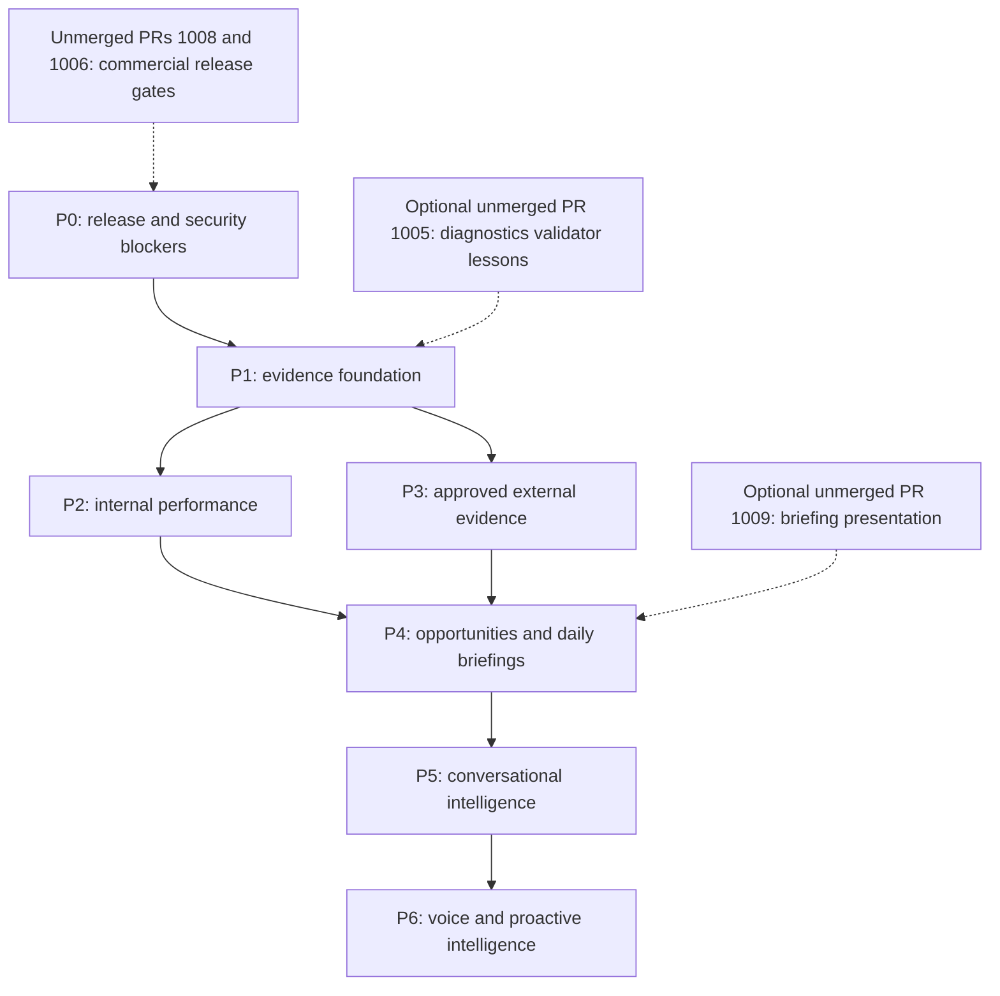

# Aida Intelligence implementation roadmap

Planning only — 2026-10-09, main baseline `5a08e2f76b786d5a45c03565b3816bcf9574971c`. No phase is authorised for implementation by this documentation task. See [Architecture](AIDA-INTELLIGENCE-ARCHITECTURE.md) for contracts/approval decisions and [Capability matrix](AIDA-INTELLIGENCE-CAPABILITY-MATRIX.md) for concrete source evidence and PR status.

## Dependency graph

P2 and P3 may proceed independently after P1. An explicitly partial internal-only briefing can be tested before external procurement completes; a comprehensive combined briefing requires both. Guided help can reuse existing text UI earlier, but full evidence-grounded conversational answers require P1/P2 and market answers require P3. Voice and proactive action never bypass previous gates.

## Effort assumptions

Estimates are engineering **person-weeks**, not calendar promises, vendor prices or authorised budgets. Assume existing modules remain reusable, one initial real-estate sales pilot, accessible text UI and limited approved sources. Include design refinement, implementation, meaningful verification and operational documentation. Exclude procurement/legal waiting, unrelated baseline repairs, provider fees, customer data cleanup and independent business identity expansion. Two engineers with shared product/security/data review may overlap P2/P3; review and external dependencies can dominate elapsed time.

| Phase | Estimated effort | Critical dependency |
| --- | --- | --- |
| P0 | 2–4 person-weeks | Existing release owners and reproducible readiness evidence; scope of baseline repair uncertain |
| P1 | 4–7 person-weeks | D2/D4/D5/D6 approvals and P0 security closure |
| P2 | 4–7 person-weeks | Historical data quality, versioned metrics and P1 |
| P3 | 3–6 person-weeks | P1 plus D3 procurement/licence approval; waiting time unbounded |
| P4 | 4–7 person-weeks | P2/P3, lifecycle schema and publication verifier |
| P5 | 3–5 person-weeks | Verified findings/briefings and governed conversation task |
| P6 | 4–8 person-weeks | Reliable text intelligence plus consent and speech approval |
| Total | **24–44 person-weeks** | P0–P6; initial text intelligence through P5: **20–36** |

AIM Financial and My Venue Clean adapter implementation/data validation is a separate proposed 2–4 person-weeks each after the common foundation; generic SME mapping 1–3. Independent multi-business authorisation is separately sized after identity design. These ranges are planning estimates with substantial uncertainty, not implementation commitments.

## P0 — Existing release and security blockers

**Reuse:** existing access/session/entitlement checks, security tests, AI routing evidence, local worker lifecycle, maintenance cron and checkout release documents.

**Required work:** independently review current main and relevant PR heads for release readiness; establish reproducible build/test baseline and record unresolved whole-repository lint/build limitations without disabling checks. Resolve tenant-before-collection boundaries for customer intelligence; prevent legacy Advisor/support routes from becoming the new pipeline's disclosure path. Inventory actual production deployment/schema/provider state read-only in a separately authorised release review. Establish fail-closed generation kill switch and ownership. Keep technical diagnostics platform-only.

**Dependencies:** #1008 compatibility/legacy-producer isolation, inventory and drain sequence and #1006 durable coordinator integration are commercial release dependencies, not feature prerequisites for offline planning. Both are OPEN/unmerged and report activation HOLD. #1005 standalone validators are OPEN/unmerged with reported build readiness HOLD; do not wait on diagnostics for customer evidence unless a concrete reusable contract is separately approved. #1009 is OPEN/unmerged and not live intelligence. No merge recommendation is made here.

**Risks:** stale PR body references, overlapping checkout changes, baseline lint/build problems, unverified deployment drift, legacy provider fallback and cross-tenant operator collection. Current evidence does not prove a production vulnerability or approved rollout; treat identified boundaries as review blockers for this pipeline.

**Acceptance:** current-head evidence recorded; security/identity authorities named; no customer generation path without gateway policy and budget; release holds remain explicit until separately closed; checkout release order approved by its owner.

**Tests:** focused auth/source/tenant-negative cases, legacy routing regressions, current affected builds and release/security suites. Checkout tests remain within their independently authorised release scope, not this documentation branch.

**Activation:** P0 is not permission to deploy. Requires independent release approval and verified build/security evidence; checkout migrations, producer isolation and reopening remain separately approved. Estimate 2–4 person-weeks, excluding unknown unrelated repairs.

## P1 — Evidence-backed intelligence foundation

**Reuse:** business context/profile/goals, Brain knowledge/source registry, Twin, connector framework, access evaluator, AI gateway/policy/registry/local jobs and Activity/AuditLog/outbox.

**Required work:** strict versioned context/evidence/rights/metric/finding contracts; server-derived scope and source permissions; effective-date knowledge validity/contradiction review; bounded evidence snapshots; claim-to-source/numeric verification; approved analysis/briefing task definitions and recipient intersections; atomic spend reservation/settlement; approved persistence/retention/deletion and orchestration lifecycle. Keep new publication metadata distinct from approved permanent knowledge while reusing its source governance infrastructure.

**Dependencies:** P0 relevant security gates; D2 identity mapping, D4 task/recipient policies, D5 budget caps, D6 persistence and retention. #1005 may inform bounded parsing but its platform diagnostics schema must not be copied as customer authority or treated as semantic verification.

**Risks:** approval status mistaken for current validity, hash mistaken for truth, classification downgrade, partial accounting, cache leak, race between revocation and disclosure/publication.

**Acceptance:** foreign/forbidden/stale/unknown-rights evidence rejected before disclosure; every accepted material claim maps to permitted evidence; unknown metrics are null with reasons; Brain updates require human approval; budget cannot overspend under concurrency; no widening fallback. Synthetic evidence works without paid calls.

**Tests:** strict decode/unknown field/boundary sizes, duplicate IDs, effective-date conflicts, tenant/source permission matrices, revocation versus claim/publication races, reference/lineage integrity, prompt injection inertness, atomic budget and exactly-once settlement, TTL/delete/backup re-purge, safe logs. Use owned disposable databases for physical constraints, no production fixtures.

**Activation:** approved schema/migration plan, recipients/regions/task outputs, hard budget configuration, permissions and retention ownership; synthetic pilot passes; keep live generation OFF until explicit approval. Estimate 4–7 person-weeks.

## P2 — Internal performance intelligence

**Reuse:** Overview live metrics, Twin snapshots/score coverage, canonical CRM/deals/tasks/leads, commerce financial snapshots, Google/search/ad adapters, service jobs and existing deterministic intelligence.

**Required work:** metric-definition registry and historical snapshots/events; completed comparable windows; cohort deduplication/maturation; validated provider aggregate completeness; currency/accounting/attribution definitions; lead/funnel/pipeline/retention/customer-experience calculations; data quality/confidence dimensions; bounded trend/anomaly analysis. Forecast only when time-ordered validation outperforms an approved naive baseline. First adapter: Roe appraisal/listing funnel and campaign evidence without assuming all records exist.

**Dependencies:** P1 and D1/D7 KPI/cohort/rubric approval; provider configuration/permissions and sufficient history. CAC, ROI, MRR and productivity remain unavailable until their own data prerequisites are met.

**Risks:** present-day totals confused with period flows, top-query summaries labelled site totals, duplicated users/conversions, partial windows, cohort selection bias, missing job hours and platform/customer revenue confusion.

**Acceptance:** known deterministic fixtures reconcile to canonical records; comparisons have identical definitions/timezones; missing/zero/failed/forbidden states differ; observed versus provisional finance is explicit; sparse data yields insufficient evidence; Roe checkpoint review can explain missing data instead of generating a price verdict.

**Tests:** formula/unit/currency/rounding boundaries, zero denominators, period/DST/month comparisons, late-arriving revisions, duplicates/refunds/partial attribution, funnel lag, incomplete costs, historical replay and anomaly false-positive review; matched-source reconciliation. Forecast holdout/error tests only for enabled metric families.

**Activation:** business owner signs off definitions and connector coverage; reconciled read-only pilot demonstrates truthful metrics; source permissions and cost limits active. No write/action activation. Estimate 4–7 person-weeks.

## P3 — Approved external intelligence

**Reuse:** connector framework, Domain/CoreLogic adapters, discovery/prospecting source references and AI visibility observations where rights and semantics are appropriate.

**Required work:** source rights register/approvals; allowlisted bounded adapters; provenance/collection and observation periods; original-source attribution; identity/geographic match; source revisions/freshness/corroboration/contradiction; dedupe across syndicated news; deletion and redisplay restrictions. Separate public observation collection from confidential tenant synthesis. Start with limited permitted local/property evidence; broader news/regulatory/search trends follow approval.

**Dependencies:** P1 and D3 licence/procurement decisions. Existing connector code does not establish tenant entitlements, redistribution permission or a trusted source; no assumption that scraping is allowed.

**Risks:** incorrect agency/locality match, asking versus sold-price confusion, expired licences, copyrighted text/narration, malicious remote content, SSRF, stale regulatory interpretation and unsupported trend-volume claims.

**Acceptance:** each observation has provider/provenance/time/window/identity/geography/rights/freshness/verification; revoked/unknown rights block use; disputed facts labelled; no automatic knowledge promotion. Claims identify the source's actual reporting period.

**Tests:** malformed/unmatched/stale provider fixtures, ambiguous names, licence denial/expiry/revocation, pagination/completeness and provider failure, syndicated duplicates, injection/URL/redirect/size controls, corrections, source purge and dependent-publication invalidation. Licensed sandbox/read-only pilot only after source approval.

**Activation:** exact contracts and allowed purposes signed off; external request/cost quotas and attribution verified; source owner monitors expiry/revisions. No provider procurement or live collection in this task. Estimate 3–6 person-weeks plus procurement waiting.

## P4 — Opportunity analysis and Daily Business Briefing

**Reuse:** existing opportunity engine, CRM tasks/deals, intelligence recommendations, AI ledger/outbox, Overview placement, cron auth/job lifecycle. #1009 supplies optional UI/contract scaffolding after independent review; its branch currently returns an empty repository and cannot supply production content.

**Required work:** opportunity lifecycle/evidence links, scoped dedupe/expiry/reassessment, outcome plans/receipts; priority rubric and industry checkpoints; job orchestration, cached immutable publication read models; scheduled/debounced event refresh; verifier-gated executive/performance/risk/opportunity/industry/action/outcome sections; partial/stale/empty/failure recovery. Evolve #1009 contract explicitly for richer evidence and partial states; never simply insert generated prose into its ready state.

**Dependencies:** P1/P2 and P3 for complete combined briefings; D1/D5/D6/D7 approvals; enough historical evidence for previous-action follow-up. UI can remain empty until prerequisites exist. No dependency on merging #1009 to design the foundation.

**Risks:** duplicate CRM deals/tasks, fabricated impact, stale actions, tenant/permission-class cache leakage, retry storms/ambiguous paid inference, unsupported price-rejection verdicts and confusing task completion with benefit.

**Acceptance:** Overview cached read immediately above Growth Performance; page loads make zero paid generation calls; scoped retries create one publication/opportunity/action; all five briefing questions addressed or explicitly unavailable; recommendations cite sources and permissions; all four Roe timing rules applied with evidence and agent/vendor approval requirements; previous outcomes report inconclusive results honestly.

**Tests:** scheduler/date/idempotency/concurrency/lease/recovery, role-specific cache and revocation, publication verification and safe rendering, no-provider dashboard tests, stale/partial/empty/budget/failure states, dedupe/update/expiry lifecycle, checkpoints at day boundaries with insufficient exposure, outcome lag/confounders and action receipt races.

**Activation:** explicit read-only Roe pilot approval, bounded sources/tasks/budgets, daily monitoring and kill-switch rehearsal; future action activation separately reviewed. Estimate 4–7 person-weeks.

## P5 — Conversational intelligence

**Reuse:** authenticated shell chat/support ownership and history, Advisor, approved Brain context, published findings/briefings and platform help retrieval. Public Aida remains a separate unauthenticated boundary.

**Required work:** intent/evidence retrieval within source rights; governed conversation task and claim-level verified answers; server-resolved entity/publication IDs; clarification/uncertainty for ambiguous or missing evidence; contextual onboarding/help from actual setup state; durable immutable action approvals and idempotency. Add campaign drafting integration only as a separately reviewed proposal flow; the current AI registry has only follow-up task creation.

**Dependencies:** P1/P2/P4; P3 for market answers; D4 new conversation task and D7 action risk/approval decisions. Do not simply route new mixed business prompts through legacy `llmChat`.

**Risks:** public/private history mixing, tenant switches/reconnect leaks, unverified browser context, overstated causality, stale cited briefings, excess interactive costs and conversational consent mistaken for permission.

**Acceptance:** six example questions in Architecture yield authorised evidence, periods, citations and uncertainty; missing evidence gives useful next steps; campaign request yields draft/preview and no send; consequential action requires reviewed bound payload and current permissions. Profile/knowledge changes remain explicitly governed.

**Tests:** authenticated multi-turn retrieval, role restrictions, history/stream reconnect/tenant switch, public token isolation, foreign listing/publication IDs, injection and unknown sources, unsupported numeric/causal claims, budget/rate limits, approval expiry/change/replay/revocation and target checks. Accessible UI and actual controlled end-to-end text flow.

**Activation:** approved conversation task, verified citations and safe action boundary; selected text pilot with monitoring and spend caps. Sending/repricing/payment tools are not implied. Estimate 3–5 person-weeks.

## P6 — Voice and proactive intelligence

**Reuse:** reliable governed text intelligence, published briefing text, existing onboarding/tutorial content and communications adapter patterns. Existing communications ElevenLabs code is not proof of an Aida microphone/transcription implementation.

**Required work:** deliberate push-to-talk, approved STT → editable text → existing reasoning → verified answer → optional TTS; accessible equivalent; separate microphone permission/recording consent; scoped transcripts, retention/deletion and provider obligations; short-lived server sessions, cancellation/interrupt/tenant switch, speech accounting. Proactive delivery requires opt-in preferences, quiet hours, relevance/deduplication, notification quotas and approval-preserving action flows. Narrated tutorials/Listen use licensed verified text.

**Dependencies:** P5 reliability and D9 speech/recording/privacy approval, D4 recipients, D5 audio budgets and D6 deletion/storage approval. Provider-direct realtime requires a separately governed adapter rather than bypassing text gateway restrictions.

**Risks:** ambient audio capture, browser speech assumed private, unintended recipients/recordings, inaccessible audio-only help, excessive costs, notification fatigue and verbal ambiguity causing action execution.

**Acceptance:** no microphone on mount/playback/reconnect; permission-denied text path works; consent and recording are distinct; stop/exit/change scope ends capture; no transcript auto-ingestion; Listen matches published text version; bounded audio budget and purge work; voice never executes consequential action without visible approval.

**Tests:** consent/permission state transitions, browser/device/STT error cases and Australian accent usability, accessibility/text equivalence, interruption/session expiry, tenant switches, signed audio access and rights expiry, deletion including caches/providers/backups, speech cost limits and proactive quiet-hour/dedupe controls. Use synthetic audio and approved recipients.

**Activation:** explicit voice pilot and notification opt-in approval, validated recipient/region/retention contracts and audio caps; recording defaults OFF. Estimate 4–8 person-weeks.

## Approval and rollout checkpoints

D1–D9 are defined in Architecture. D8 requires separate release and pilot activation approval. Approve scope/identity/metrics first, then data contracts/source licences/routing/budgets, then read-only pilot acceptance. Approval to plan is not approval to implement. Approving a code PR later is not approval for production schema changes, provider activation, checkout reopening or consequential actions.

Every future phase must deliver: independently reviewed evidence, meaningful positive/negative tests, deterministic no-provider regression mode, migration/rollback plan if applicable, scoped permissions, cost accounting, operator runbook and explicit activation decision. Rollback preserves canonical business records, audit receipts and security constraints; disable generation/disclosure before restoring prior read models. Do not enable a phase to obtain test data from production prematurely.

## Documentation delivery validation

This branch contains only the three requested Markdown documents. Validation checks local Markdown links against actual files on the pinned main worktree, document cross-links, balanced Mermaid fences, phase/decision consistency, required industry/checkpoint topics and whitespace. PR #1009's relevant branch code was reviewed read-only; PR status for #1005/#1006/#1008/#1009 was queried, all OPEN/unmerged at audit time. PR-reported runtime checks were not repeated or presented as current production proof.

No application tests/build are needed for this Markdown-only diff; running them would not establish the proposed architecture's correctness. No application code, migration, production configuration, paid AI invocation, deployment or merge is part of this task. The dedicated documentation branch is committed/pushed and submitted as a draft for architecture review only; the final report supplies its PR URL.
