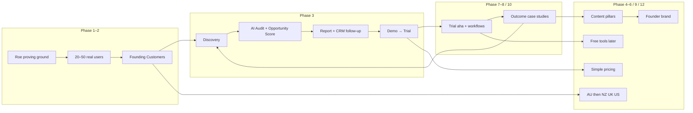

# DigitalGate — Rollout & Go-to-Market Strategy

**Status:** Canonical · Product / marketing strategy locked · August 2026  
**Canonical path:** [`docs/strategy/DIGITALGATE-ROLLOUT.md`](./DIGITALGATE-ROLLOUT.md)  
**Source:** Platform Architect (Ben)  
**ADR:** [0013 — GTM / rollout strategy adopted](../adr/0013-gtm-rollout-strategy-adopted.md)

> **This document locks how DigitalGate is positioned, launched, and grown.**  
> It does **not** authorize building free public audits, LinkedIn content systems, or a pricing-page redesign now. Docs first; product work follows Roadmap + Architecture Brief priorities.

### Marketing mode now (locked)

**Do** run the marketing machine in **controlled pre-launch / founding mode** — audience, build-in-public, and (when ready) founding outreach.  
**Do not** full-scale spend or claim a “complete AI Business OS.”

| Now | Next commercial milestone | Public launch |
|-----|---------------------------|---------------|
| Phase 1 audience / narrative | **5 founding agencies** (scoped outcome, not free trial) | After ~10–20 active (Gate 3) |

Sell a **specific customer outcome** (esp. RE): Website → AI Vis → SEO → Leads → CRM → Automation → Appointments → Opportunities.  
Readiness + pre-sell checklist: [COMMERCIALLY-READY-V1.md](../foundations/COMMERCIALLY-READY-V1.md). **Gate 2 is not cleared** until that checklist holds.

---

## Positioning (locked)

| Layer | Line |
|-------|------|
| **Category** | AI-powered **Business Operating Platform** |
| **Outcome** | **One platform to run, understand and grow your business** |
| **Brand** | *The Gateway to Your Digital World™* (unchanged) |

### Immediate positioning change

Stop leading with “marketing platform,” feature inventories, or “40 things we do.”

Lead with the **outcome**: one place to **run**, **understand**, and **grow** the business. Marketing, CRM, websites, SEO, AI Visibility, Industry Apps, and Infrastructure are **capabilities inside** that platform — not the category story.

| Say | Don’t say (primary) |
|-----|---------------------|
| Business Operating Platform / Business OS | Marketing platform |
| Run · understand · grow | Here’s our feature list |
| Start with the platform, add as you grow | Buy every module on day one |
| Honest scores from measurable signals | Fake ChatGPT / Gemini citation ranks |

**Architecture alignment:** same category language as [GEN-2-ARCHITECTURE-BRIEF.md](../architecture/GEN-2-ARCHITECTURE-BRIEF.md) (“AI-powered Business Operating Platform”). Vision narrative: [PRODUCT-VISION.md](../PRODUCT-VISION.md). Capability map: [CAPABILITY-MODEL.md](../CAPABILITY-MODEL.md).

---

## Alignment with locked architecture (do not contradict)

| Lock | Canonical | GTM implication |
|------|-----------|-----------------|
| Gen 2 north-star | [GEN-2-ARCHITECTURE-BRIEF.md](../architecture/GEN-2-ARCHITECTURE-BRIEF.md) · [ADR 0012](../adr/0012-gen-2-architecture-brief-adopted.md) | Sell the OS; don’t promise every §1–36 item |
| Connector Priority / DG15 | [CONNECTOR-PRIORITY.md](../foundations/CONNECTOR-PRIORITY.md) | Wedge connectors matter more than broad marketplace noise |
| Wantd | [WANTD.md](../WANTD.md) | Separate org on DG infra — not a DG App in the pitch |
| Opportunity Engine | [OPPORTUNITY-ENGINE.md](../foundations/OPPORTUNITY-ENGINE.md) · [ADR 0010](../adr/0010-opportunity-engine-remains-core.md) | Prospecting Engine (Phase 3) is how *we* sell — Core capability, Command UI |
| Reputation hybrid | [ADR 0011](../adr/0011-reputation-core-plumbing-growth-app.md) | No decorative Reputation / Twin scores in claims |
| AI Visibility honesty | [SEO-AND-AI-VISIBILITY.md](../foundations/SEO-AND-AI-VISIBILITY.md) | Presence / SEO-style probes only — **no** invented LLM citation ranks |
| Build globally / sell AU | [GLOBAL-READINESS.md](../foundations/GLOBAL-READINESS.md) | Country Packs ready; **marketing AU first** |
| Commercial packaging | [COMMERCIAL-MODEL.md](../foundations/COMMERCIAL-MODEL.md) | Platform tiers + Industry Apps; Feature Registry licenses features |
| **Hold:** no digitalgate.com.au cutover yet | WP detach / Gen 1 still live | Market Gen 2 at `app.digitalgate.com.au`; don’t force public-site cutover |
| **Hold:** no fake scores | Scoring + Twin | Never demo hardcoded “72 / 92” or invented MRR |

---

## Phase 1 — Wedge + audience (now → first 90 days)

**Market:** Australian **real estate agencies**.  
**Proving ground:** Internal dogfood — **DG, Roe, CVH, Aëtherra, Wantd** — then founding RE peers.  
**Marketing mode:** Build audience / build-in-public narrative. **No** major public acquisition spend yet.  
**Near-term commercial goal:** path to **5 founding agencies** on a real weekly workflow — not vanity signups, not “launch DigitalGate.”

Focus:

1. Platform Core + RE App depth that Roe (and similar) can run daily  
2. Clear outcome narrative (digital presence → structured vendor acquisition) on every surface  
3. Outcome evidence from Roe (workflow + scores that are **real**)  
4. Command Centre Growth Engine / Prospecting Engine for *our* pipeline — staff-facing  
5. Close Gate 1 + pre-sell checklist before active founding outreach ([COMMERCIALLY-READY-V1.md](../foundations/COMMERCIALLY-READY-V1.md))

**Hold:** international marketing (NZ / UK / US campaigns); full-scale spend; “complete AI BOS” claims. Architecture stays Country Pack–ready; GTM stays AU RE.

See also: [RE-BETA-LAUNCH.md](../RE-BETA-LAUNCH.md) · [ROADMAP.md](../ROADMAP.md) Workstream 2.

---

## Phase 2 — Founding Customer Programme

**Next milestone:** **5 founding agencies** (indicative mix **3–5 RE + 2–3 SME**) under Gate 2 ([COMMERCIALLY-READY-V1.md](../foundations/COMMERCIALLY-READY-V1.md)). Broader founding seats / ~10–20 active / 50–100+ are later — not this milestone. Not “beta testers.”

| Principle | Detail |
|-----------|--------|
| Framing | Founding programme — limited AU businesses shaping the OS with Ben (**not** a free trial) |
| Value | Founding pricing for feedback + case studies / influence — not unpaid QA |
| Quality bar | Real agencies (start AU RE); active use of the outcome workflow, not logo collection |
| Outreach | Prospecting engine path once pre-sell checklist clears |
| Exit into | Standard Starter / Pro / Business after founding proof + Gate 3 readiness |
| Engineering bar | Launch statement in Commercially Ready v1 — Ben not holding it together |

Commercial detail lives in [COMMERCIAL-MODEL.md](../foundations/COMMERCIAL-MODEL.md); readiness gates + pre-sell 6 reds in [COMMERCIALLY-READY-V1.md](../foundations/COMMERCIALLY-READY-V1.md). This phase locks **naming and intent** only. **Do not claim Gate 2 cleared.**

---

## Phase 3 — Prospecting Engine sells the platform

DigitalGate’s **own** acquisition OS (Command Centre Growth Engine + Opportunity Engine) is the primary sales motion:

```
Discovery → AI Audit → Opportunity Score → Report
    → CRM / pipeline → follow-up → demo → trial → customer
```

| Step | System |
|------|--------|
| Discovery | [BUSINESS-DISCOVERY.md](../foundations/BUSINESS-DISCOVERY.md) |
| Audit / score | Presence + opportunity signals — honest only |
| Daily “who today” | [OPPORTUNITY-ENGINE.md](../foundations/OPPORTUNITY-ENGINE.md) |
| Pipeline / conversion | [GROWTH-ENGINE.md](../GROWTH-ENGINE.md) |

**Not** an autonomous AI SDR. **Not** invented MRR. Staff-assisted, signal-ranked.

---

## Phase 4 — Product-led free tools (later)

Public free audits as top-of-funnel → trial:

Website · AI Visibility · GBP · SEO · Growth · Real Estate audits

**Hold for implementation:** do not ship this programme until Phase 1 wedge users and honest audit surfaces are solid. When built, claims must match [SEO-AND-AI-VISIBILITY.md](../foundations/SEO-AND-AI-VISIBILITY.md) (presence / technical — **not** fake ChatGPT citation ranks).

---

## Phase 5 — Content pillars

| Pillar | Intent |
|--------|--------|
| **AI Visibility** | How businesses show up in AI-era discovery (honest measurement) |
| **Business OS** | Run the business in one platform |
| **Automation & AI** | Workflows that save time and improve decisions |
| **Industry intelligence** | What happened → why it matters → what to do ([INDUSTRY-INTELLIGENCE.md](../foundations/INDUSTRY-INTELLIGENCE.md)) |
| **Digital infrastructure** | Domains, email, hosting, connect ([INFRASTRUCTURE.md](../foundations/INFRASTRUCTURE.md)) |

Content supports the OS category — not a marketing-agency blog.

---

## Phase 6 — Personal brand / LinkedIn (founder-led)

Ben as the face of the Business OS thesis: AU RE stories, architecture honesty, outcome case studies.

**Hold for implementation:** no LinkedIn content system / automation in this lock — strategy only.

---

## Phase 7 — Demonstrate workflows visually

Show **workflows** (vendor lead → settlement, discovery → report → trial), not only static screenshots. Screen recordings, guided tours, and in-product aha (Phase 10) beat feature grids.

---

## Phase 8 — Outcome case studies

Publish measurable outcomes from Roe and founding customers: time saved, pipeline clarity, visibility improvements from **real** scores, revenue / retention where disclosed.

No fabricated benchmarks.

---

## Phase 9 — Pricing simplicity

| Platform | Industry |
|----------|----------|
| **Starter** · **Pro** · **Business** | **Industry Apps** (RE, Accommodation, Services, …) as add-ons |

Narrative: **Start with the platform, add as you grow.** Generous core — don’t nickel-and-dime the OS.

Align packaging with [COMMERCIAL-MODEL.md](../foundations/COMMERCIAL-MODEL.md) (Feature Registry). Naming note: GTM uses **Business**; older commercial drafts may say Agency — converge copy to **Business** when pricing surfaces are next touched. **Do not** redesign the live pricing page as part of this doc lock.

---

## Phase 10 — Interactive free trial aha

Guided path that creates the memory moment:

```
Business Profile → connect systems → analyse
    → DigitalGate Score (honest composite)
    → top 5 fixes
```

Ties to Roadmap “wow moment” ([ROADMAP.md](../ROADMAP.md)) — Twin / Scoring / Overview. Scores only from measurable signals.

---

## Phase 11 — AI as sales assistant that demonstrates the product

Use AI in demos and trials the way customers will: recommend next actions, draft follow-ups, explain scores — **showing** the OS, not pitching a chatbot.

Staff AI sales assist stays inside Command / Growth Engine constraints (no fake pipeline math).

---

## Phase 12 — Geography

| Rule | Detail |
|------|--------|
| **Build** | Globally ready (Country Packs, locales, connectors) |
| **Market** | **Australia first** |
| **Expansion order** | **AU → NZ → UK → US** |

Matches [GLOBAL-READINESS.md](../foundations/GLOBAL-READINESS.md) stages (AU RE → AU multi-industry → NZ → UK → North America). **No international demand-gen until AU wedge is working.**

---

## First 12 months (execution table)

| Window | Focus | Success signal |
|--------|--------|----------------|
| **Months 0–3** | Phase 1: Gate 1 dogfood (DG/Roe/CVH/Aëtherra/Wantd); audience + build-in-public; pre-sell checklist; Prospecting Engine for *our* pipeline | Gate 1 closing; honest wow path; path to 5 founding offers |
| **Months 3–6** | Founding programme open (scoped); recruit **5 founding agencies**; RE App depth; first outcome stories | 5 founding active on core workflow; retention > vanity traffic |
| **Months 6–9** | Prove workflow → toward ~10–20 active; tighten Prospecting → founding/paid; content pillars start | Repeatable demo → founding → paid; Gate 3 evidence building |
| **Months 9–12** | Public launch readiness if Gate 3 holds; founding → standard tiers; prepare free-tool PLG design; AU multi-industry *design* only if RE is solid | Public SaaS only after ~10–20 active; NZ still **not** primary marketing |

Exact engineering order remains [ROADMAP.md](../ROADMAP.md) + Architecture Brief Immediate Priority 1–15.

---

## Metrics (not vanity traffic)

| Category | Examples |
|----------|----------|
| **Acquisition** | Qualified AU RE prospects; audits → demos; founding applications |
| **Activation** | Profile complete; ≥1 connector; first DigitalGate / presence score; top-5 fixes viewed |
| **Retention** | WAU / MAU of real users; Roe daily workflow; churn of founding seats |
| **Commercial** | Trial → paid; ARPU; Industry App attach; Refer & Earn (platform SaaS) |
| **Outcome** | Time-to-first-value; opportunity actions completed; customer-reported growth / efficiency |

Do **not** optimise for: raw pageviews, follower counts, or demo scores that aren’t in the product.

---

## Flywheel



**Loop in one line:** Real AU RE usage → credible outcomes → Prospecting Engine finds more agencies → trial aha → founding/paid → stories and content → more qualified demand — still AU-first.

---

## Explicit holds

| Hold | Until |
|------|--------|
| International marketing (NZ / UK / US) | AU wedge + founding motion working |
| Fake AI citation / ChatGPT rank claims | True citation monitoring exists (not MVP) |
| Decorative Twin / Reputation / demo scores | Real data path exists |
| digitalgate.com.au public cutover | WP detach / Gen 2 SoT programme says go |
| Free public audit PLG build-out | Phase 1 users + honest audits solid |
| LinkedIn / content automation build | Strategy only this lock |
| Pricing page redesign | Trivial copy alignment only if already editing |

---

## First 90 days — founder focus (Ben)

1. **Positioning:** Every pitch, README, and demo opens with Business Operating Platform + outcome line.  
2. **Wedge:** Roe daily on Gen 2; chase 20–50 real AU RE users.  
3. **Sell with the product:** Run Discovery → Audit → Opportunity Score → follow-up in Command Centre.  
4. **Founding programme:** Name, offer, and first invites — not “beta.”  
5. **Honesty:** Scores and AI Visibility claims match what Gen 2 measures today.  
6. **Do not:** Intl campaigns, fake citation marketing, or boiling the ocean on free tools / pricing redesign.

---

## Related documents

| Doc | Role |
|-----|------|
| [PRODUCT-VISION.md](../PRODUCT-VISION.md) | Brand, mission, pillars |
| [ROADMAP.md](../ROADMAP.md) | Engineering execution |
| [GEN-2-ARCHITECTURE-BRIEF.md](../architecture/GEN-2-ARCHITECTURE-BRIEF.md) | Architecture constraints |
| [CAPABILITY-MODEL.md](../CAPABILITY-MODEL.md) | Core / Growth / Apps map |
| [GLOBAL-READINESS.md](../foundations/GLOBAL-READINESS.md) | Country Packs + geo stages |
| [GROWTH-ENGINE.md](../GROWTH-ENGINE.md) | Internal acquisition OS |
| [OPPORTUNITY-ENGINE.md](../foundations/OPPORTUNITY-ENGINE.md) | Daily “who today” |
| [COMMERCIAL-MODEL.md](../foundations/COMMERCIAL-MODEL.md) | Licensing / revenue streams |
| [SEO-AND-AI-VISIBILITY.md](../foundations/SEO-AND-AI-VISIBILITY.md) | Honest visibility scores |
| [docs/README.md](../README.md) | Docs index |
